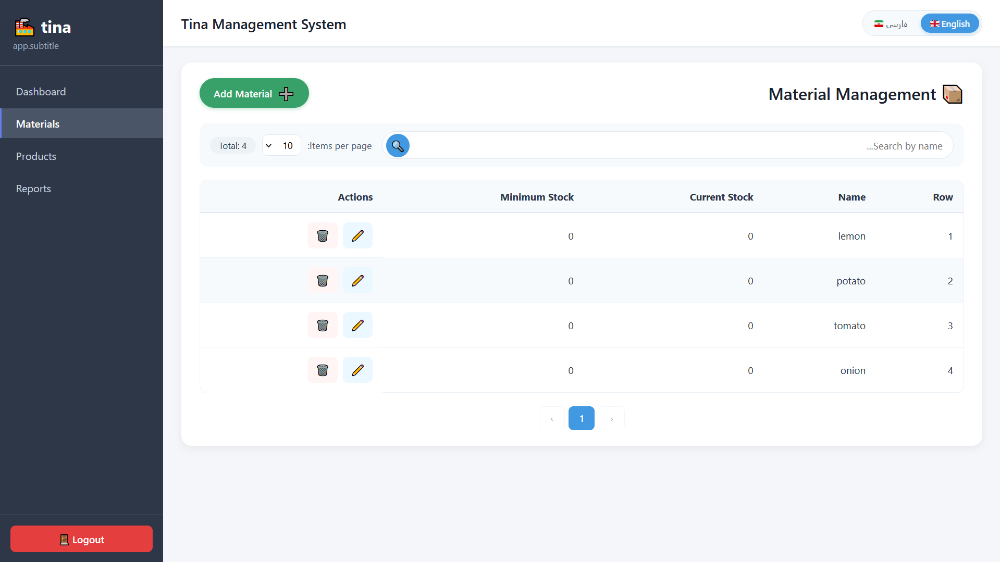
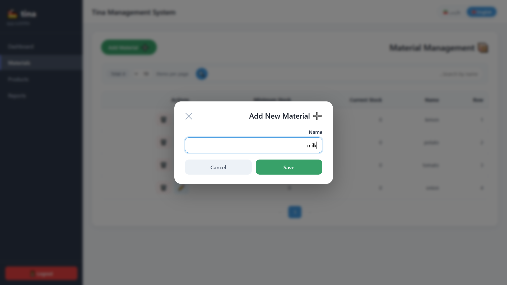

# Branch Notes: Material Management Module

> **Branch:** `feature/material`
> **Last Updated:** 2026-09-24

---

## 📋 Overview

This branch implements the **Material Management** module for the Tina project.
It provides a complete CRUD API for managing raw materials, along with
i18n support, validation, pagination, and full unit/integration test coverage.

---

## ✨ Features Implemented

### 1. Domain Layer
- **Entity:** `Material` with fields:
    - `id` (Long, auto-generated)
    - `name` (String, required)
    - `currentStock` (Integer, default 0)
    - `minimumStock` (Integer, default 0)

### 2. Repository Layer
- `MaterialRepository` extends `JpaRepository`
- Custom query methods:
    - `findByName(String name)`
    - `findByNameContaining(String name, Pageable pageable)`

### 3. Service Layer
- `MaterialServiceImpl` with methods:
    - `create(MaterialDTO)` — new materials start with stock = 0
    - `update(Long id, MaterialDTO)`
    - `delete(Long id)`
    - `findById(Long id)`
    - `findAll(Pageable)`
    - `searchByName(String, Pageable)`

### 4. Validator Layer
- `MaterialValidatorImpl`:
    - Prevents duplicate names on insert
    - Prevents duplicate names on update (only if name changed)
    - Throws `BusinessException` with proper error codes

### 5. Controller Layer
- REST endpoints at `/api/materials`:
    - `POST   /api/materials` — create
    - `PUT    /api/materials/{id}` — update
    - `DELETE /api/materials/{id}` — delete
    - `GET    /api/materials/{id}` — find by id
    - `GET    /api/materials` — paginated list
    - `GET    /api/materials/search?name=...` — search by name

### 6. DTO & Response
- `MaterialDTO` as Java `record` (immutable)
- `ApiResponse<T>` wrapper for consistent API responses
- `PageResponse<T>` for paginated results

---

## 🌍 Internationalization (i18n)

- Full support for **English** and **Persian (Farsi)**
- Message files:
    - `i18n/messages.properties` (default → English)
    - `i18n/messages_fa.properties` (Persian)
- `GlobalExceptionHandler` uses `MessageSource` to translate error codes
- Frontend sends `Accept-Language` header via Axios interceptor
- Locale detected via `AcceptHeaderLocaleResolver`

**Example:**
| Error Code | English | Persian |
| :--- | :--- | :--- |
| `error.material.not.found` | Material not found | مواد اولیه‌ای یافت نشد |
| `error.material.already.exists` | Material already exists | مواد اولیه قبلاً ثبت شده است |

---

## 🧪 Test Coverage

All layers are tested with **JUnit 5** and **Mockito**.

| Test Class | Test Count | Coverage |
| :--- | :--- | :--- |
| `MaterialRepositoryTest` | 9 | Save, find, pagination, LIKE search, delete |
| `MaterialValidatorImplTest` | 7 | Insert/update duplicate checks, not-found |
| `MaterialServiceImplTest` | 12 | CRUD, pagination, defaults, error handling |
| `MaterialControllerTest` | 11 | All endpoints, error paths, security-free tests |
| **Total** | **39 tests** | ✅ All passing |

**Test infrastructure:**
- `@DataJpaTest` for repository (H2 in-memory)
- `@WebMvcTest` with `@AutoConfigureMockMvc(addFilters = false)`
- `MockitoExtension` for unit tests
- `AssertJ` for fluent assertions

---

## 🗄️ Database Migrations (Flyway)

- `V1__create_material_table.sql` — initial table creation
- (Future versions will handle schema evolution)

---

## 🛠️ Tech Stack Used

| Layer | Technology |
| :--- | :--- |
| Language | Java 21 |
| Framework | Spring Boot 4.1.1 |
| Persistence | Spring Data JPA + Hibernate 7 |
| Database | PostgreSQL 16 |
| Migrations | Flyway |
| Testing | JUnit 5, Mockito, AssertJ |
| i18n | Spring MessageSource + i18next (frontend) |
| Build | Gradle |

---

## 🚧 Known Limitations / TODO

- [ ] Authentication is currently disabled (`permitAll`) — to be enabled before production
- [ ] Add caching layer (Redis) for frequently accessed materials

---

## 🖼️ Screenshots

---

## 🔗 Related Files
